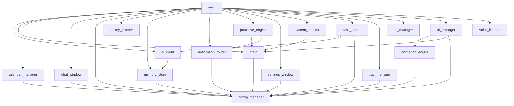

# Project Dependency Graph

This document provides a fully connected graph and structural breakdown of the Virtual Pet project. You can use the Mermaid graph or the detailed Obsidian links below to navigate files and see which file depends on which.

## Interactive Graph

## File Connections

### [[ai_client.py]]
**Imports these files:**
- [[memory_store.py]]

**Is used by:**
- [[main.py]]
- [[task_runner.py]]

---

### [[animation_engine.py]]
**Imports these files:**
- [[config_manager.py]]

**Is used by:**
- [[ui_manager.py]]

---

### [[brain.py]]
**Imports these files:**
- [[config_manager.py]]

**Is used by:**
- [[main.py]]
- [[proactive_engine.py]]
- [[system_monitor.py]]
- [[ui_manager.py]]

---

### [[calendar_manager.py]]
**Imports these files:**
- [[config_manager.py]]

**Is used by:**
- [[main.py]]

---

### [[chat_window.py]]
**Imports these files:**
- [[config_manager.py]]

**Is used by:**
- [[main.py]]

---

### [[config_manager.py]]
*Does not depend on any internal files.*

**Is used by:**
- [[animation_engine.py]]
- [[brain.py]]
- [[calendar_manager.py]]
- [[chat_window.py]]
- [[main.py]]
- [[memory_store.py]]
- [[notification_router.py]]
- [[settings_window.py]]
- [[task_runner.py]]
- [[tray_manager.py]]
- [[ui_manager.py]]

---

### [[hotkey_listener.py]]
*Does not depend on any internal files.*

**Is used by:**
- [[main.py]]

---

### [[main.py]]
**Imports these files:**
- [[ai_client.py]]
- [[brain.py]]
- [[calendar_manager.py]]
- [[chat_window.py]]
- [[config_manager.py]]
- [[hotkey_listener.py]]
- [[memory_store.py]]
- [[notification_router.py]]
- [[proactive_engine.py]]
- [[settings_window.py]]
- [[system_monitor.py]]
- [[task_runner.py]]
- [[tray_manager.py]]
- [[tts_manager.py]]
- [[ui_manager.py]]
- [[voice_listener.py]]

*Is not imported by any internal files.*

---

### [[memory_store.py]]
**Imports these files:**
- [[config_manager.py]]

**Is used by:**
- [[ai_client.py]]
- [[main.py]]

---

### [[notification_router.py]]
**Imports these files:**
- [[config_manager.py]]

**Is used by:**
- [[main.py]]
- [[proactive_engine.py]]

---

### [[proactive_engine.py]]
**Imports these files:**
- [[brain.py]]
- [[notification_router.py]]

**Is used by:**
- [[main.py]]

---

### [[settings_window.py]]
**Imports these files:**
- [[config_manager.py]]

**Is used by:**
- [[main.py]]

---

### [[system_monitor.py]]
**Imports these files:**
- [[brain.py]]

**Is used by:**
- [[main.py]]

---

### [[task_runner.py]]
**Imports these files:**
- [[ai_client.py]]
- [[config_manager.py]]

**Is used by:**
- [[main.py]]

---

### [[tray_manager.py]]
**Imports these files:**
- [[config_manager.py]]

**Is used by:**
- [[main.py]]

---

### [[tts_manager.py]]
*Does not depend on any internal files.*

**Is used by:**
- [[main.py]]

---

### [[ui_manager.py]]
**Imports these files:**
- [[animation_engine.py]]
- [[brain.py]]
- [[config_manager.py]]

**Is used by:**
- [[main.py]]

---

### [[voice_listener.py]]
*Does not depend on any internal files.*

**Is used by:**
- [[main.py]]

---

